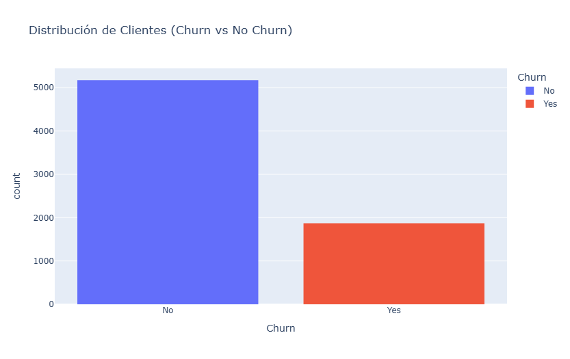
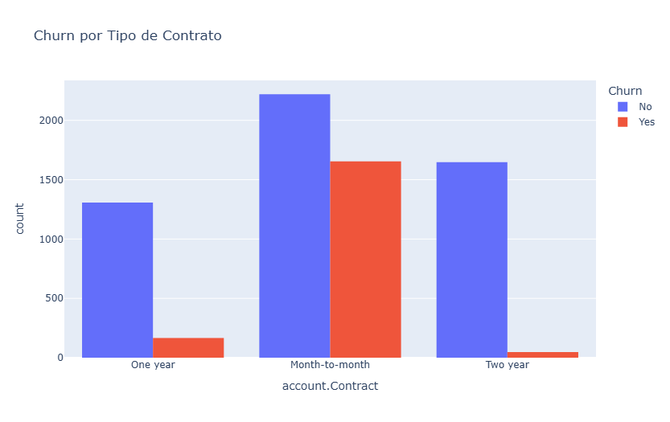
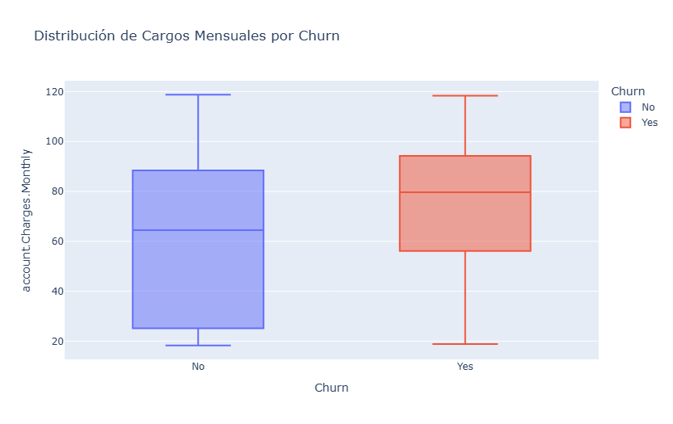
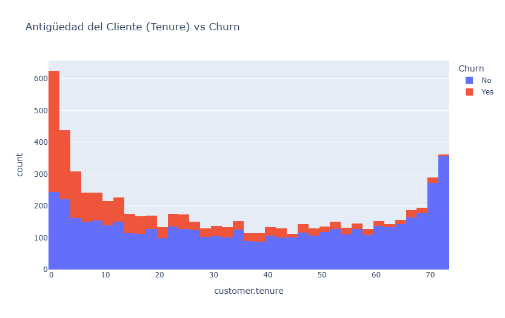
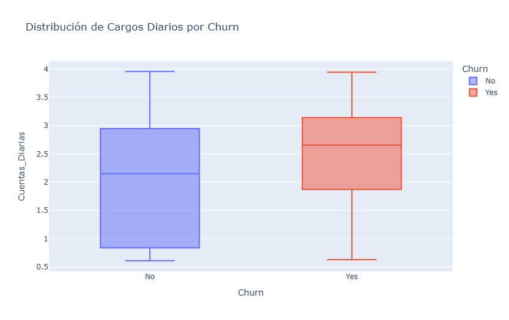
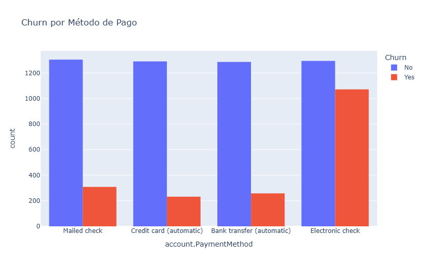
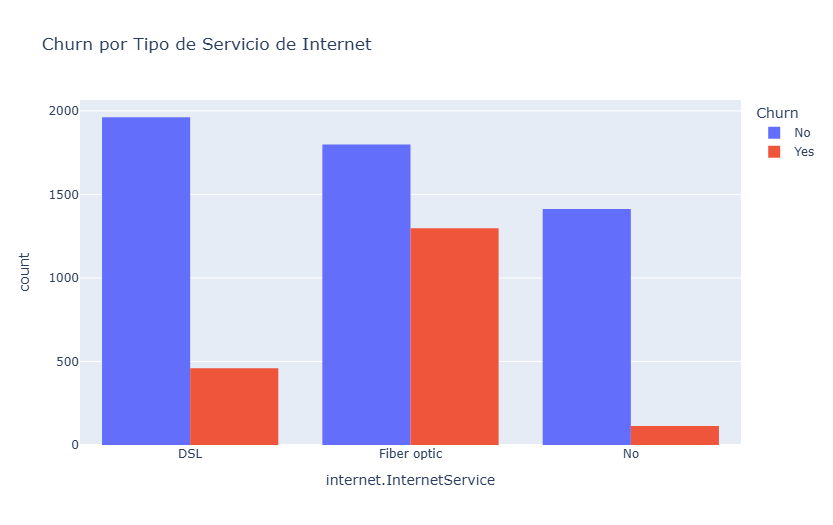

# 📊 Informe Final - Análisis de Evasión de Clientes (Churn) - Telecom X

## 🧩 Introducción

Este informe forma parte del proyecto **"Churn de Clientes"** de la empresa **Telecom X**, cuyo objetivo es analizar la pérdida de clientes y entender los factores que influyen en su decisión de cancelar el servicio. El análisis se basa en datos históricos de clientes, procesados con Python y visualizados con gráficos interactivos.

---

## 🔍 Metodología

- **Extracción**: Se utilizó un archivo JSON que contiene información detallada de clientes.
- **Transformación**: Se desanidaron columnas jerárquicas y se creó una variable adicional `Cuentas_Diarias`.
- **Limpieza**:
  - Conversión de datos no numéricos a numéricos (`Charges.Total`).
  - Eliminación de registros con valores vacíos en la variable objetivo `Churn`.
- **Visualización**: Se generaron gráficos con Plotly para análisis interactivo.

---

## 📊 Análisis Gráfico y Hallazgos

### 1. Distribución General del Churn

- Existe una proporción considerable de clientes que han cancelado su servicio.
- La clase `No` es mayoritaria, pero el porcentaje de `Yes` es significativo.

### 2. Churn por Tipo de Contrato

- Los clientes con contrato **"Month-to-month"** presentan la mayor tasa de cancelación.
- Contratos de **"One year"** y **"Two year"** tienen menor churn, lo que sugiere mayor fidelización.

### 3. Cargos Mensuales vs Churn

- Los clientes que cancelan tienden a tener cargos mensuales más **elevados**.
- Esto indica una posible **sensibilidad al precio**.

### 4. Antigüedad del Cliente (Tenure)

- Clientes con menos meses de antigüedad tienen mayores tasas de churn.
- Muchos clientes cancelan dentro de sus primeros 10 meses.

### 5. Cargos Diarios Promedio

- Los clientes que hacen churn también presentan **mayores cargos diarios en promedio**.

### 6. Método de Pago

- El método **"Electronic check"** está fuertemente relacionado con altas tasas de churn.
- Métodos automáticos como **"Bank transfer"** o **"Credit card"** presentan mejores tasas de retención.

### 7. Tipo de Servicio de Internet

- Los usuarios de **"Fiber optic"** son más propensos a cancelar comparado con los de **"DSL"**.
- Esto puede deberse a expectativas de calidad o precios más elevados.

---

## ✅ Conclusiones y Recomendaciones

- **Contratos mensuales** deben ser objeto de estrategias de conversión a contratos largos.
- Identificar clientes nuevos (poca antigüedad) y con cargos altos para aplicar **ofertas de retención**.
- Revaluar experiencia y precios del servicio **Fiber optic**.
- Incentivar el uso de **pagos automáticos** con beneficios adicionales.

---

## 🚀 Próximos Pasos

- Entrenamiento de modelos predictivos de churn.
- Segmentación avanzada de clientes para campañas personalizadas.
- Integración de datos de atención al cliente para enriquecer el análisis.
